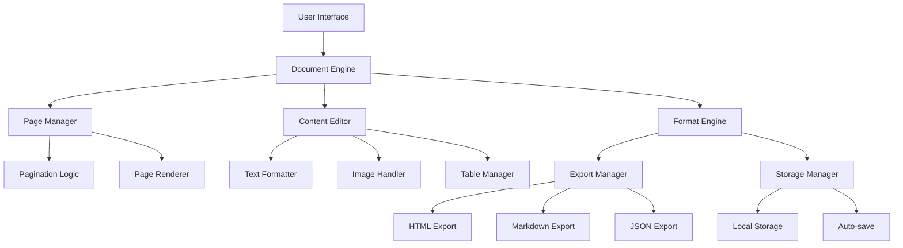

# Document Processor Architecture

## Overview
Document Processor is a browser-based document creation and editing tool that provides professional US Letter format documents with automatic pagination, rich text editing, and export capabilities.

## System Architecture



## Core Components

### Document Engine
- **Purpose**: Central orchestrator for all document operations
- **Responsibilities**:
  - Coordinate between UI and data layers
  - Manage document state
  - Handle user interactions
  - Trigger appropriate sub-systems

### Page Manager
- **Purpose**: Handle document pagination and page flow
- **Key Features**:
  - Automatic page break detection
  - Content overflow management
  - Page number tracking
  - Table of Contents generation

### Content Editor
- **Purpose**: Rich text editing capabilities
- **Features**:
  - Text formatting (bold, italic, underline)
  - Headers (H1, H2, H3)
  - Lists (ordered/unordered)
  - Links and quotes
  - Code blocks

### Format Engine
- **Purpose**: Handle document export and storage
- **Supported Formats**:
  - JSON (native format)
  - HTML (standalone files)
  - Markdown
  - Future: PDF export

## Data Flow

1. **User Input** → Content Editor → Page Manager → Document State
2. **Auto-save** → Document State → Storage Manager → Local Storage
3. **Export** → Document State → Format Engine → File Download
4. **Page Break** → Content → Pagination Logic → New Page Creation

## Technical Specifications

### Page Layout
- **Size**: US Letter (8.5" × 11")
- **Margins**: 1 inch all sides
- **Content Area**: 6.5" × 9"
- **Font**: System default, 12pt
- **Line Height**: 1.6

### Storage Format
```json
{
  "pages": [{
    "pageNumber": 1,
    "content": "HTML content string"
  }],
  "pageCount": 1,
  "timestamp": "ISO 8601 date",
  "version": "2.0",
  "format": "US Letter",
  "margins": "1 inch"
}
```

## Design Decisions

### Single Page Application
- **Decision**: Keep as browser-based SPA
- **Rationale**: No server requirements, works offline, instant loading

### ContentEditable API
- **Decision**: Use native contentEditable for editing
- **Rationale**: Rich formatting support, native browser behavior, no external editor library needed

### Local Storage for Persistence
- **Decision**: Use browser localStorage for auto-save
- **Rationale**: Simple, reliable, no backend needed, preserves user privacy

### Modular Architecture (Planned)
- **Decision**: Refactor monolithic code into modules
- **Rationale**: Improve maintainability, enable unit testing, better LLM comprehension

## Future Architecture Goals

1. **Modularization**: Split into discrete, focused modules
2. **Plugin System**: Allow custom formatters and exporters
3. **Collaborative Editing**: WebRTC-based peer-to-peer collaboration
4. **Cloud Sync**: Optional cloud storage integration
5. **Template System**: Pre-designed document templates